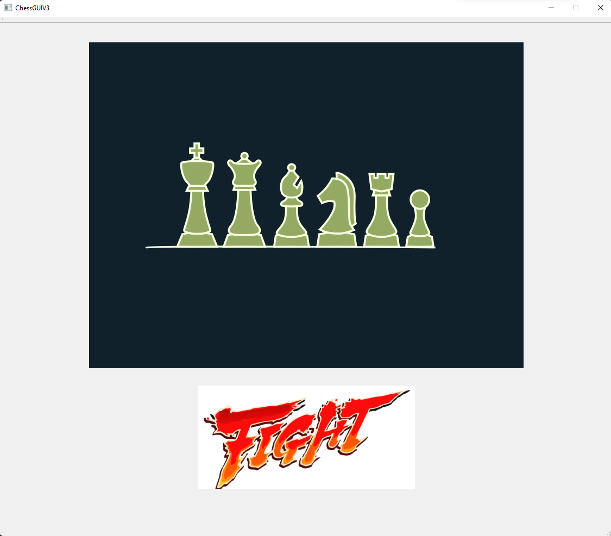
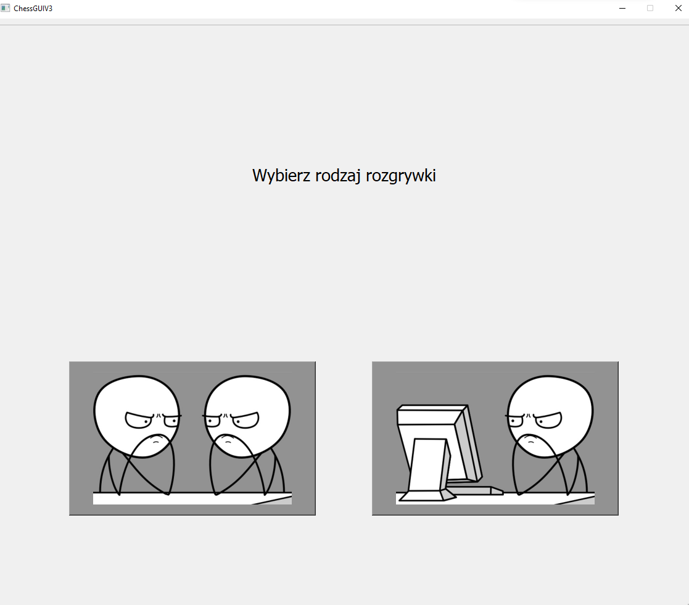
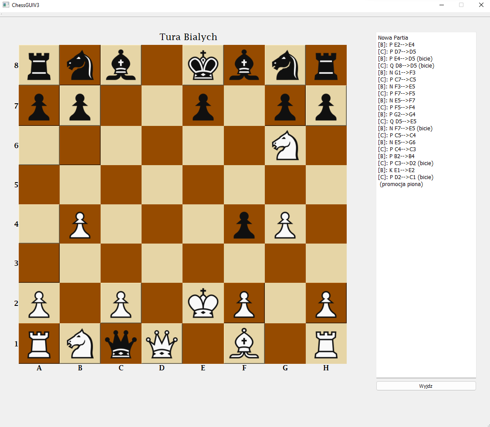
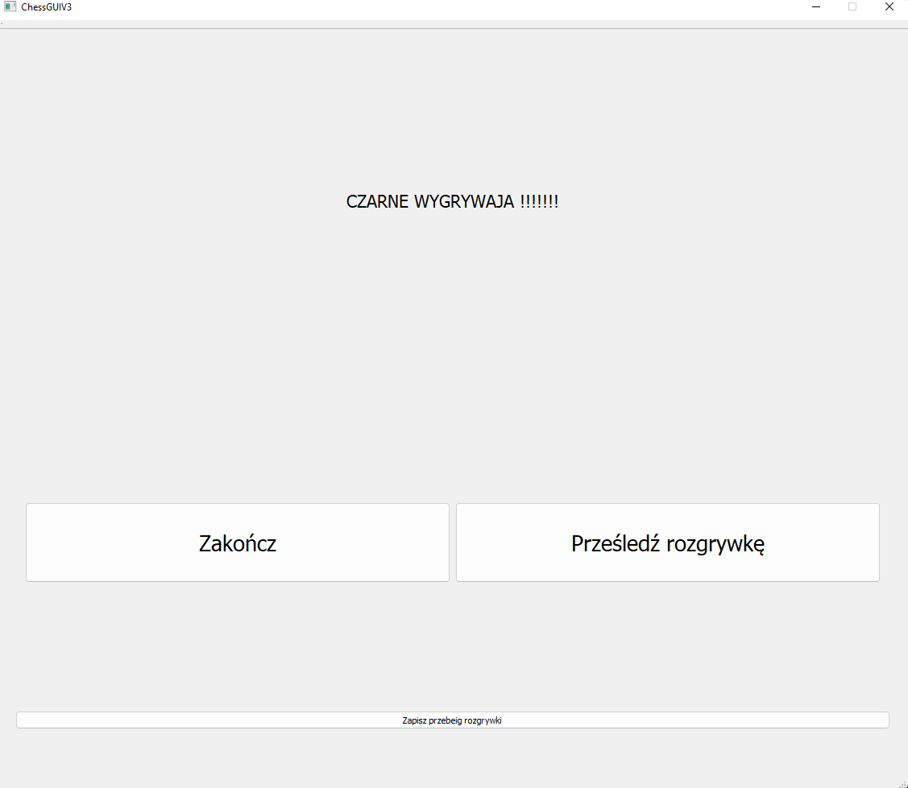

# Chees-2021
Chess game implementation in C++ done as group assigment on PROI university course.

# Description
This is simple chess game implementation following all chess rules allowing user to play with other player(on the same machine) or with AI (AI is dumb it moves randomly, but captures figures if possible and prioritize King defense when it is checked). All moves are tracked so game can be "replayed" after game or saved to txt. file. Game is entirely done in Polish. This project was done in group of 3.

Project consists of few main clases:
- GameEngine - tracks current state of game and contains all rules of game.
- Board - implementation of chess board.
- Chess - represents every figure in game. 
- ChessGUIV3 - Qt class responsible for displaying UI.
- Test classes.

# Requirements
Project requires C++ compiler and Qt version 5.15.2 to work. 
All work was done in Visul Studio.

# Screenshots
*None of the graphics/ gifs used in project were not done by us, we are not the authors of them.*

### Main menu:

 

 

### Gameplay:

 

### End Screen:

 

# Contributors:
Project was done with [Krystian Grela](https://github.com/GreysonKrystian) and Aleksander Woś.
